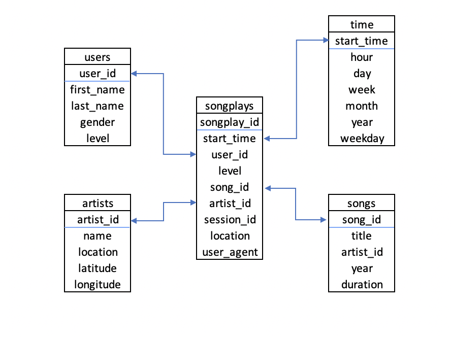

## Project 3: Data Warehouse

#### Introduction
A startup called Sparkify wants to analyze the data they've been collecting on songs and user activity on their new music streaming app. The analytics team is particularly interested in understanding what songs users are listening to. Currently, they don't have an easy way to query their data, which resides in a directory of JSON logs on user activity on the app, as well as a directory with JSON metadata on the songs in their app.

#### Project Description
This project is to build an ETL pipeline that extracts their data from S3, stages them in Redshift, and transforms data into a set of dimensional tables for their analytics team to continue finding insights in what songs their users are listening to.

#### File Description
```create_tables.py``` drops and creates the tables. <br>
```etl.py``` extracts data from the S3 bucket and loads them into Redshift. <br>
```sql_queries.py``` contains all the sql queries, including DROP, CREATE, COPY, and INSERT. <br>
```dhw.cfg``` contains infomation about Redshift, IAM and S3.

#### Database Schema
Fact table: songplays <br>
Dimensions tables: songs, artists, users, and start_time
* Fields with underline are primary keys.


#### ETL Pipeline
* Create a cluster in Redshift
* Create tables as needed based on the star schema in the database
* Copy, load, and transform the data that are stored in the S3 bucket <br>
* Insert the data to the corresponding tables
* Test the database

#### How to Run
* Open the terminal
* Enter `` python create_tables.py`` to connect to the database and create tables in the cluster
* Enter `` python etl.py`` to execute the ETL process
